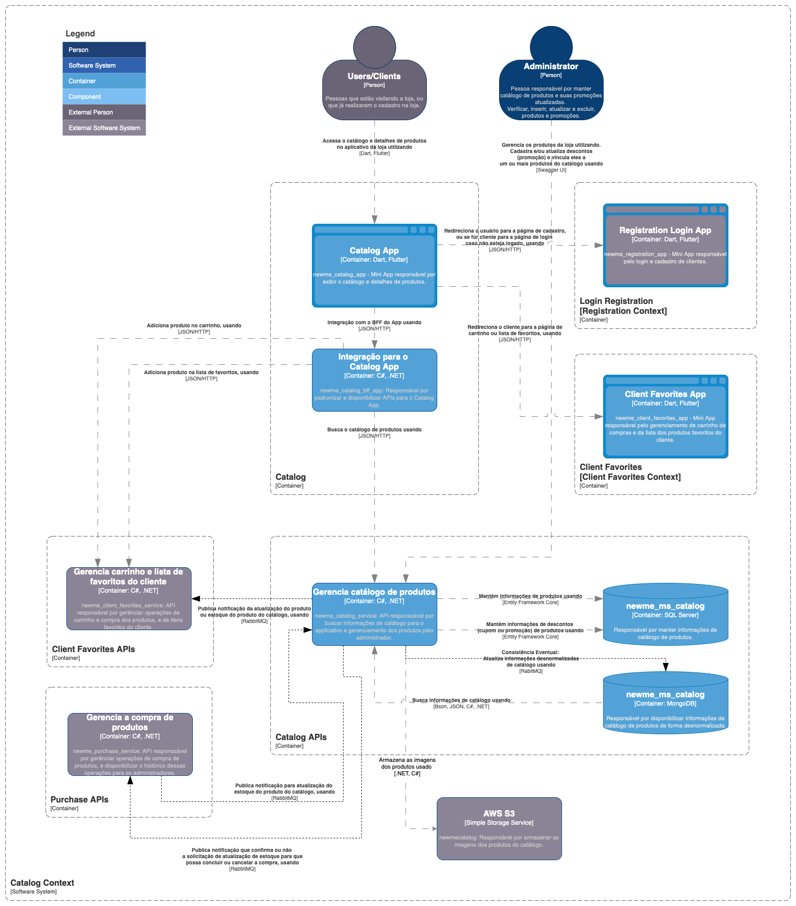
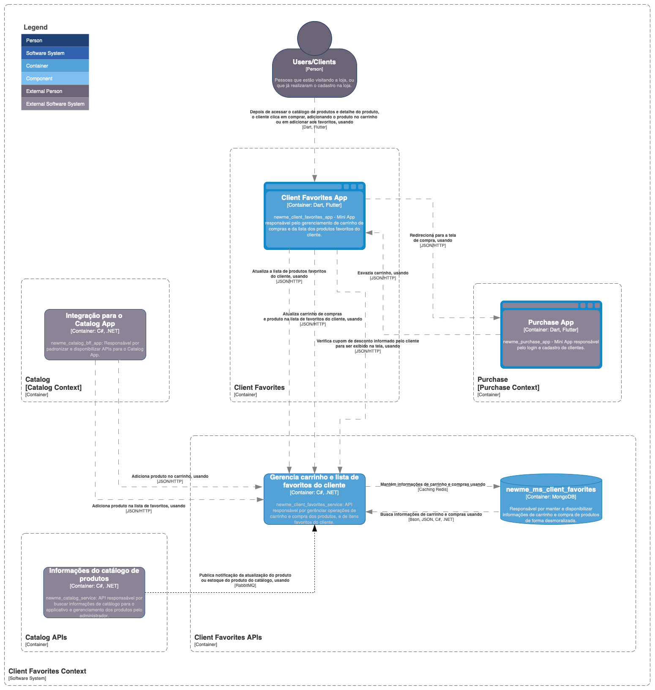
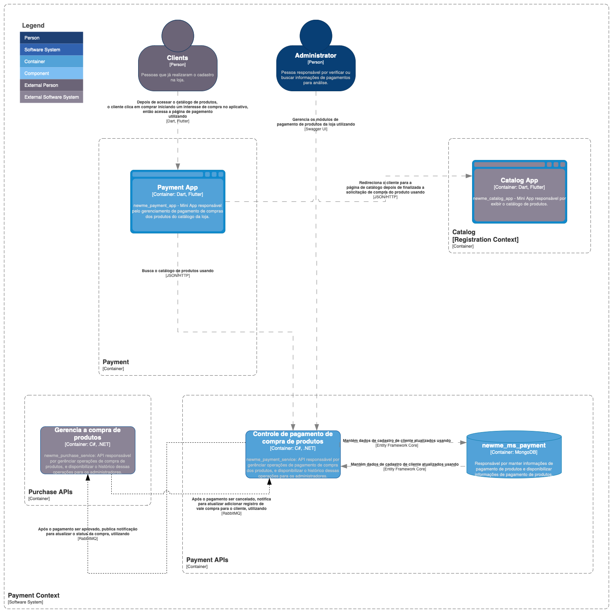

# TCC-Computer-Science-UFRRJ
Documentation and source code for my final project in Computer Science at the Universidade Federal Rural do Rio de Janeiro.

Theme: Microservices Architecture Analysis Using CQRS: Development of an E-commerce System as a Practical Example

### Microservices available in:
#### newme-catalog: https://github.com/gabrielleraujo/newme-catalog
#### newme-purchase: https://github.com/gabrielleraujo/newme-purchase
#### newme-payment: https://github.com/gabrielleraujo/newme-payment
#### newme-client-favorites: https://github.com/gabrielleraujo/newme-client-favorites

### Documentation
Availeble at assets/doc/tcc_presentation_revised
### C4 diagrams

